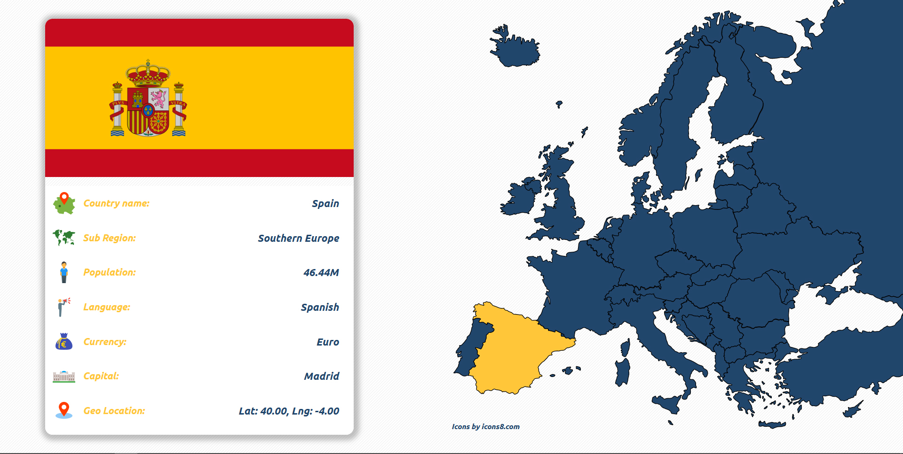

# Europe Map Project
Hello,
if you click on the any random country in the map of Europe, 
you will get all basic data about that state in the container on the left side.
SVG map file is also the illustration of <a href="https://stock.adobe.com/images/map-of-europe-with-eu-countries-highlighted-in-blue/56504335?prev_url=detail" >mine.<a/>

 

 
  
# Fun challenge
Try to locate and click on the: Andorra, Luxebmourg and Liechtenstein.(They do exist, I Promise.all) 
# Tech
HTML, CSS, JavaScript.

This is my first project where I worked with some third party API (REST Countries).
Promises were hanled with ASYNC/AWAIT syntax.
Since names of the countries are 'hardcoded' in the SVG file itself,
only two types of Errors were handled, when user looses internet connection 
and if the request is lasting too long (5s).
Errors will be displayed in the flag container.

There is one @media query that decreases the font and the padding in the 
info container, which makes rendering on the 15 inch lap-top screens ok.
# Note
There is a strange bug if you click on the country of Andorra. 
Flag field remains blank, I checked with my map, id is correct.
It has to be some problem with the API
